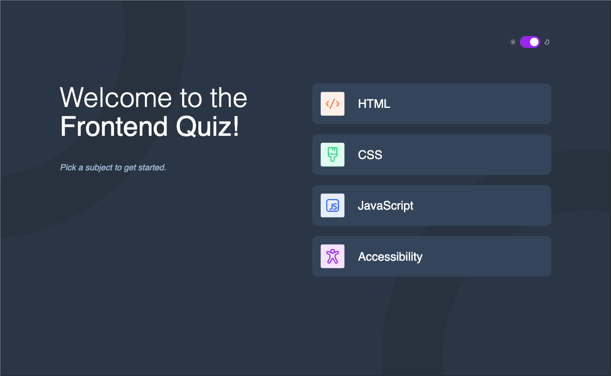

# Frontend Mentor - Frontend quiz app solution

This is a solution to the [Frontend quiz app challenge on Frontend Mentor](https://www.frontendmentor.io/challenges/frontend-quiz-app-BE7xkzXQnU). Frontend Mentor challenges help you improve your coding skills by building realistic projects.

## Table of contents

- [Overview](#overview)
  - [The challenge](#the-challenge)
  - [Screenshot](#screenshot)
  - [Links](#links)
- [My process](#my-process)
  - [Built with](#built-with)
  - [What I learned](#what-i-learned)
  - [Continued development](#continued-development)
  - [Useful resources](#useful-resources)
- [Author](#author)

## Overview

### The challenge

Users should be able to:

- Select a quiz subject
- Select a single answer from each question from a choice of four
- See an error message when trying to submit an answer without making a selection
- See if they have made a correct or incorrect choice when they submit an answer
- Move on to the next question after seeing the question result
- See a completed state with the score after the final question
- Play again to choose another subject
- View the optimal layout for the interface depending on their device's screen size
- See hover and focus states for all interactive elements on the page
- Navigate the entire app only using their keyboard
- **Bonus**: Change the app's theme between light and dark

### Screenshot

### Links

- Solution URL: [Here](https://www.frontendmentor.io/solutions/react-typescript-and-sass-YUa0xxXYZ0)
- Live Site URL: [Here](https://nv-frontend-quiz-app.vercel.app/)

## My process

### Built with

- [React](https://reactjs.org/) - JS library
- Typescript
- Semantic HTML
- SASS/SCSS
- Flexbox
- CSS Grid
- Mobile-first workflow

### What I learned

Throughout this project I learned and implemented Typescript and a Dark/Light mode. This was the first time using Typescript in an application and I feel like I adopted it pretty quickly. The Dark/Light mode was also a first for me to use in an application. I chose to control this with dynamic classes that apply the different styles.

### Continued development

I am excited to continue to use Typescript as I feel it is a neccesity with modern development practices. I also plan on continuing to challenge and grow on all my frontend skills to be a better developer.

### Useful resources

- [React](https://react.dev) - This provides great documentation to assist with your React applications.
- [Typescript](https://www.typescriptlang.org/) - This also provides great documentation for implementing typescript into your applciations.

## Author

- Portfolio - [Nate Valline](https://natevalline.dev)
- Frontend Mentor - [@nvalline](https://www.frontendmentor.io/profile/nvalline)
- LinkedIn - [Nate Valline](https://www.linkedin.com/in/nvalline)
